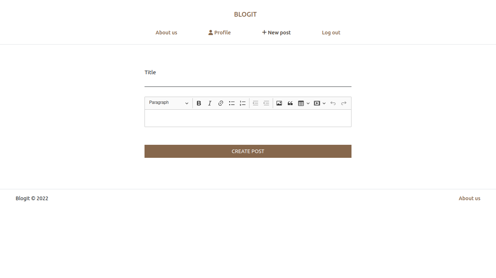
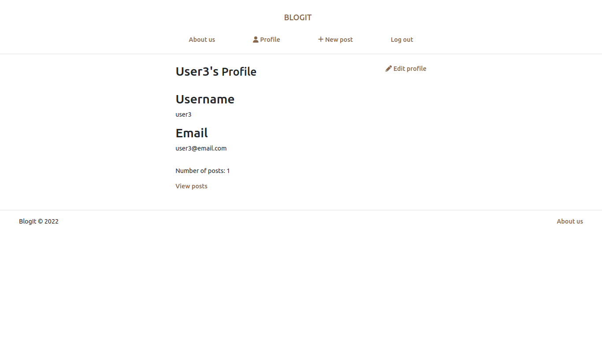
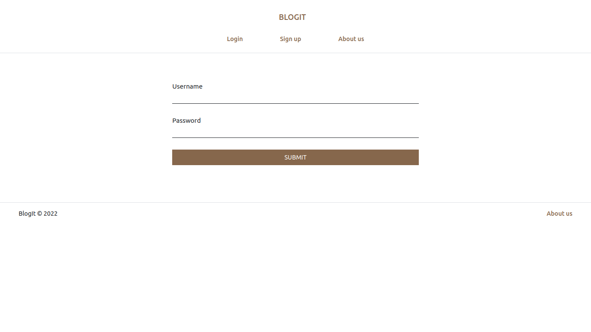

# BlogIt

***

## Table of contents
- [Previews](#previews)
- [Description](#description)
- [Components](#components)
- [Api](#api)
- [Usage](#usage)
- [Issues](#issues)
- [Authors](#authors)

## Previews
> 
>
> 
>
>
>
>

## Description
A blogging application with minimal features built with simplicity in mind 
There are two categories of users: authenticated and unauthenticated 
Authenticated in users are able to:
- view other user's posts
- create, view and delete their posts
- comment on other user's posts
Anonymous users on the other hand are only able to view posts and read comments.

## Components
The application is comprised of a single page application frontend and a REST backend 
The frontend is a single page application made using [React](https://reactjs.org/docs/getting-started.html) and [Redux](https://redux-toolkit.js.org/) 
The backend runs on [Node.js](https://nodejs.org/) and uses the [Express](https://expressjs.com/) framework

- [Frontend](./frontend)
- [Backend](./backend/)

## Api
Data is obtained from and sent to the backend using a REST api 
Changes can therefore be made from both browsers as well as clients that can send data to the api, such as curl

## Usage
### Prerequisites
- npm (**Ensure nodejs is installed. Installation instructions can be found [here](https://nodejs.org/en/download/) for mac, windows and linux**)
- set the following environment variables(use .env or set in command line)
  - `SECRET_KEY` - for generating tokens
  - `DB_URI` - mongodb server uri
  - `ENVIRONMENT`(optional) - defaults to 'development'
  - `PORT`(optional) - defaults to 8000
  - **the .env file should be placed in the backend folder**
- alternatively, you could set the variables directly on the command line. See [run](./run) for more information
- run `./setup` to install dependencies
- run `./run` to run the server

## Issues
- The json token is not invalidated on logout, could lead to impersonation if someone other than the owner were to get their hands on it before expiry
- Transitioning in between pages in the frontend sometimes fails
- Some of the content delivered to the frontend is unescaped to prevent raw html tags from being displayed to the user. This could be exploited to carry out xss

For more information, check out the README files in the frontend and backend folders

## Authors
Joshua Omari - [Github](https://github.com/joshua530)
